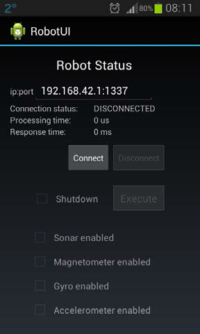
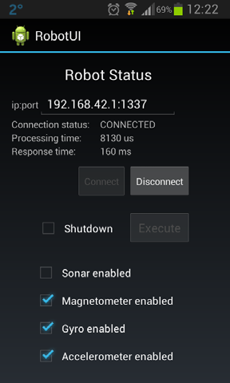
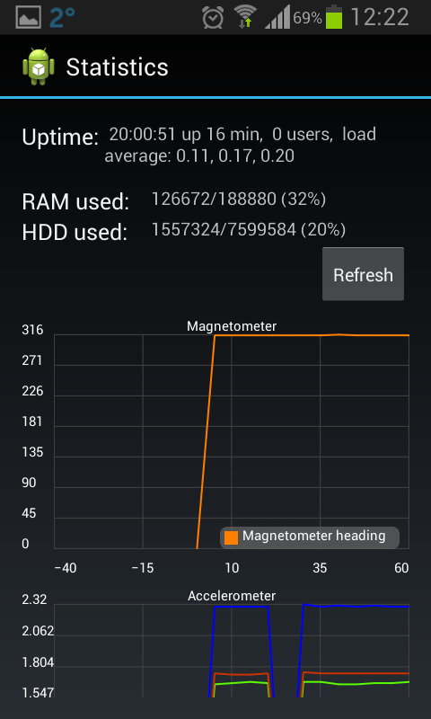
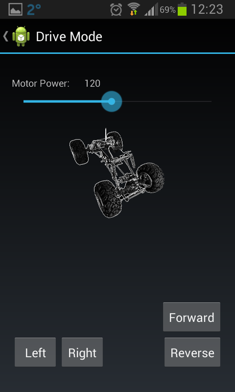
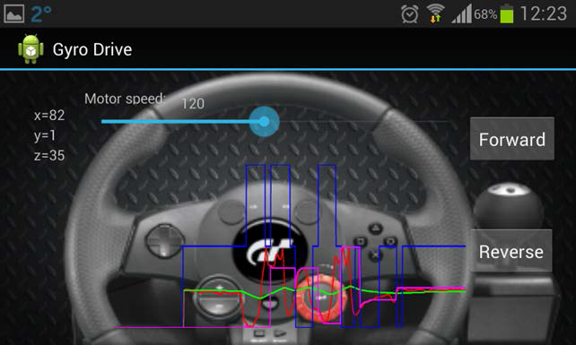

#### Android GUI for mobile robot - robotUI

Generic Android project. Created using Eclipse IDE via Android SDK. 

Documentation (in lithuanian) available in ***docs*** directory. 
Prebuilt binary .apk file available in ***bin*** directory.

***Screenshots***

***Dependencies used:***
* Graphview v3.1 - Android plotting library
* sshj - SSH library

***Changelog:*** 
* 2013-12-22 Initial version 1.0.0
